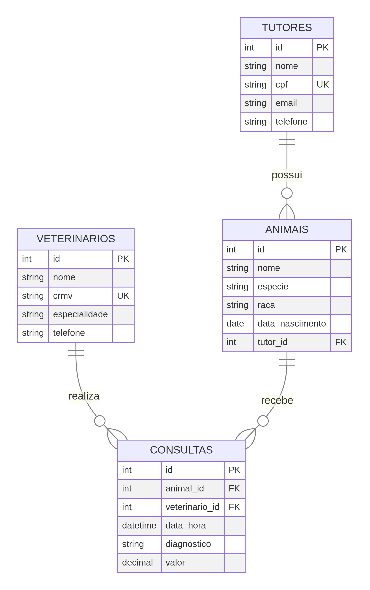

<div align="center">

# 🐾 PetVida — Sistema de Gestão para Clínica Veterinária

[](https://www.mysql.com/)
[](https://nodejs.org/)
[](https://expressjs.com/)
[](LICENSE)

> **Projeto acadêmico** de banco de dados relacional completo, com API REST, procedures, triggers e views — desenvolvido para gerenciamento de uma clínica veterinária fictícia.

<div align="center">
  <a href="https://petvida-db.vercel.app/api-docs" target="_blank">
    
  </a>
  <a href="https://htmlpreview.github.io/?https://github.com/AlexandreCalmon-devBa/petvida-db/blob/main/docs/tutorial_deploy.html" target="_blank">
    
  </a>
</div>

</div>

---

## 📋 Descrição do Projeto

O **PetVida** é um sistema de banco de dados relacional desenvolvido para gerenciar as operações de uma clínica veterinária. O projeto cobre o ciclo completo de atendimento: do cadastro de tutores e animais ao agendamento de consultas, registros de pagamentos e auditoria automática via triggers.

A camada de API REST (Node.js + Express) expõe todos os recursos do banco, incluindo chamadas diretas a stored procedures. A lógica de negócio — como validação de agendamentos, bloqueio de exclusão de consultas pagas e preenchimento automático de datas — vive inteiramente no banco de dados, demonstrando o uso avançado de SQL em nível de produção.

O projeto foi construído em 9 tarefas incrementais, partindo da modelagem do DER até a documentação final, cobrindo tópicos como normalização, segurança (roles/grants), functions escalares, views, triggers BEFORE/AFTER e stored procedures com tratamento de erros via `SIGNAL`.

---

## 🗺️ Diagrama Entidade-Relacionamento (DER)

<div align="center">
  
</div>

---

## 🛠️ Tecnologias Utilizadas

| Tecnologia | Versão | Uso |
|---|---|---|
| **MySQL** | 8.0+ | Banco de dados principal |
| **Node.js** | 18+ | Runtime da API |
| **Express** | 5.x | Framework HTTP |
| **mysql2** | 3.x | Driver MySQL para Node |
| **swagger-ui-express** | 5.x | Documentação interativa da API |
| **Jest + Supertest** | — | Testes automatizados |
| **dotenv** | — | Variáveis de ambiente |

---

## 🚀 Instalação e Execução

### Pré-requisitos

- MySQL 8.0+ em execução
- Node.js 18+
- npm

### 1. Clone o repositório

```bash
git clone https://github.com/AlexandreCalmon-devBa/petvida-db.git
cd petvida-db
```

### 2. Configure as variáveis de ambiente

```bash
cp .env.example .env
# Edite o .env com suas credenciais do MySQL
```

```env
DB_HOST=localhost
DB_PORT=3306
DB_USER=root
DB_PASSWORD=sua_senha
DB_NAME=petvida
```

### 3. Crie o banco de dados

Execute os scripts na ordem abaixo:

```bash
mysql -u root -p < database/schema.sql
mysql -u root -p petvida < database/seed.sql
mysql -u root -p petvida < database/views.sql
mysql -u root -p petvida < database/functions.sql
mysql -u root -p petvida < database/triggers.sql
mysql -u root -p petvida < database/procedures.sql
```

### 4. Instale as dependências e inicie a API

```bash
npm install
npm run dev
```

A API local estará disponível em: **http://localhost:3000**
Documentação Swagger Local: **http://localhost:3000/api-docs**

🌐 **Ambiente de Produção (Nuvem):**
- **Documentação da API:** [https://petvida-db.vercel.app/api-docs](https://petvida-db.vercel.app/api-docs)
- **Tutorial Interativo de Deploy:** [Acessar Tutorial](https://htmlpreview.github.io/?https://github.com/AlexandreCalmon-devBa/petvida-db/blob/main/docs/tutorial_deploy.html)

> **Windows**: use o `iniciar_servidor.bat` para iniciar com duplo clique localmente.

---

## 📡 Endpoints da API

### 🐕 Animais — `/api/animais`

| Método | Rota | Descrição |
|--------|------|-----------|
| `GET` | `/api/animais` | Lista todos os animais (via view detalhada) |
| `GET` | `/api/animais/:id` | Busca animal por ID |
| `POST` | `/api/animais` | Cadastra novo animal |
| `PUT` | `/api/animais/:id` | Atualiza dados do animal |
| `DELETE` | `/api/animais/:id` | Remove animal (bloqueia se tiver consultas) |

### 🩺 Veterinários — `/api/veterinarios`

| Método | Rota | Descrição |
|--------|------|-----------|
| `GET` | `/api/veterinarios` | Lista todos os veterinários |
| `GET` | `/api/veterinarios/:id` | Busca veterinário por ID |
| `POST` | `/api/veterinarios` | Cadastra novo veterinário |
| `PUT` | `/api/veterinarios/:id` | Atualiza dados do veterinário |
| `DELETE` | `/api/veterinarios/:id` | Remove veterinário |

### 📅 Consultas — `/api/consultas`

| Método | Rota | Descrição |
|--------|------|-----------|
| `GET` | `/api/consultas` | Lista todas as consultas |
| `GET` | `/api/consultas/:id` | Busca consulta por ID |
| `POST` | `/api/consultas` | Agenda consulta via `sp_agendar_consulta` |
| `PUT` | `/api/consultas/:id/concluir` | Conclui consulta via `sp_concluir_consulta` |
| `DELETE` | `/api/consultas/:id` | Cancela consulta via `sp_cancelar_consulta` |

### 💳 Pagamentos — `/api/pagamentos`

| Método | Rota | Descrição |
|--------|------|-----------|
| `GET` | `/api/pagamentos` | Lista todos os pagamentos |
| `GET` | `/api/pagamentos/:id` | Busca pagamento por ID |
| `POST` | `/api/pagamentos/:consulta_id` | Registra pagamento via `sp_registrar_pagamento` |
| `PUT` | `/api/pagamentos/:id` | Atualiza pagamento |
| `DELETE` | `/api/pagamentos/:id` | Remove pagamento |

### 📊 Relatórios — `/api/relatorios`

| Método | Rota | Descrição |
|--------|------|-----------|
| `GET` | `/api/relatorios/dashboard` | Dashboard financeiro (total, recebido, pendente) |
| `GET` | `/api/relatorios/inadimplentes` | Lista consultas com pagamento pendente |

---

## 🗄️ Estrutura do Banco de Dados

### Tabelas

| Tabela | Descrição |
|--------|-----------|
| `especies` | Tipos de animais (Cão, Gato, etc.) |
| `tutores` | Dados dos proprietários dos animais |
| `veterinarios` | Dados dos profissionais (CRMV, especialidade) |
| `animais` | Cadastro dos animais atendidos |
| `consultas` | Histórico de agendamentos e atendimentos |
| `pagamentos` | Registros financeiros das consultas |
| `log_auditoria` | Rastreamento automático de alterações |

### Views

| View | Descrição |
|------|-----------|
| `vw_animais_detalhados` | Animais com nome do tutor e espécie |
| `view_consultas_completas` | Consultas com todos os detalhes |
| `vw_inadimplentes` | Consultas com pagamento pendente |

### Functions

| Função | Retorno |
|--------|---------|
| `fn_idade_animal(data_nascimento)` | Idade formatada: "X anos Y meses" |
| `fn_total_gasto_tutor(tutor_id)` | Soma total das consultas do tutor |
| `fn_qtd_consultas_animal(animal_id)` | Quantidade de consultas do animal |
| `fn_status_emoji(status)` | Status formatado com texto descritivo |
| `fn_classificar_valor(valor)` | Classifica consulta por faixa de valor |

### Triggers

| Trigger | Evento | Ação |
|---------|--------|------|
| `trg_after_insert_consulta` | AFTER INSERT | Registra nova consulta no log |
| `trg_after_update_consulta_status` | AFTER UPDATE | Registra mudança de status no log |
| `trg_before_delete_consulta` | BEFORE DELETE | Bloqueia exclusão se consulta já foi paga |
| `trg_after_insert_animal` | AFTER INSERT | Registra novo animal no log |
| `trg_before_update_pagamento` | BEFORE UPDATE | Preenche `data_pagamento` automaticamente |

### Stored Procedures

| Procedure | Descrição |
|-----------|-----------|
| `sp_agendar_consulta` | Agenda consulta com validações de negócio |
| `sp_concluir_consulta` | Marca consulta como realizada com diagnóstico |
| `sp_cancelar_consulta` | Cancela atendimento (valida status) |
| `sp_registrar_pagamento` | Registra pagamento e atualiza status |
| `sp_relatorio_receitas` | Gera relatório financeiro por período |

---

## 📁 Estrutura de Pastas

```
petvida-db/
├── 📁 database/          # Scripts SQL do banco de dados
│   ├── schema.sql        # Criação das tabelas e constraints
│   ├── seed.sql          # Dados iniciais de teste
│   ├── views.sql         # Views (consultas nomeadas)
│   ├── functions.sql     # Functions escalares
│   ├── triggers.sql      # Triggers de auditoria e validação
│   ├── procedures.sql    # Stored procedures de negócio
│   ├── reports.sql       # Queries de relatório
│   └── security.sql      # Roles e permissões de usuários
│
├── 📁 src/               # Código-fonte da API REST
│   ├── app.js            # Configuração do Express
│   ├── server.js         # Ponto de entrada do servidor
│   ├── swagger.json      # Especificação OpenAPI
│   ├── 📁 config/
│   │   └── database.js   # Conexão com o MySQL
│   └── 📁 routes/
│       ├── animais.routes.js
│       ├── consulta.routes.js
│       ├── pagamentos.routes.js
│       ├── relatorios.routes.js
│       └── veterinario.routes.js
│
├── 📁 docs/              # Documentação e diagramas
│   ├── der.png           # Diagrama Entidade-Relacionamento
│   └── petvida_postman_collection.json
│
├── 📁 backups/           # Dumps do banco de dados
├── 📁 test/              # Testes automatizados (Jest)
├── .env.example          # Template de variáveis de ambiente
├── .gitignore
├── iniciar_servidor.bat  # Script de inicialização (Windows)
├── package.json
├── LICENSE
└── README.md
```

---

## 🧪 Testes

```bash
# Executar todos os testes
npm test

# Gerar relatório HTML
npm run test:report
```

---

## 📝 Exemplos de Uso SQL

```sql
-- Idade formatada dos animais
SELECT nome, fn_idade_animal(data_nascimento) AS idade
FROM animais;

-- Total gasto por tutor
SELECT t.nome, fn_total_gasto_tutor(t.id) AS total_gasto
FROM tutores t;

-- Agendar nova consulta
CALL sp_agendar_consulta(1, 2, DATE_ADD(NOW(), INTERVAL 7 DAY), 150.00);

-- Consultar log de auditoria
SELECT * FROM log_auditoria ORDER BY data_hora DESC LIMIT 20;

-- Dashboard financeiro
SELECT * FROM vw_inadimplentes;
```

---

## 👤 Autor

**Alexandre Calmon**

[](https://github.com/AlexandreCalmon-devBa)

---

<div align="center">
  <sub>Projeto desenvolvido para a disciplina de Banco de Dados — 2026</sub>
</div>
